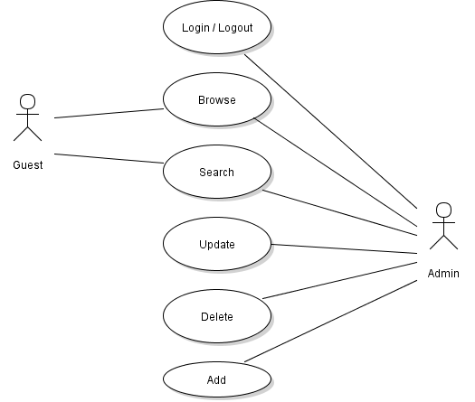

# Movie DB Interface in PHP

Available at: http://student.labranet.jamk.fi/~H8871/www/palvelinohjelmointi/php-moviedb-harjtyo  
phpDocumentor generated API: http://student.labranet.jamk.fi/~H8871/www/palvelinohjelmointi/api

[Introduction](#introduction)  
[Requirements](#requirements)  
[Issues](#issues)  
[Closing Report](#closing-report)  
[Spent Time](#spent-time)  

## Introduction

The purpose of this project is to create a web app in PHP for a database containing movie titles and personel who worked with said movie titles.

It will use the Slim 2.x micro framework. Version 3.x is available but the school server does not support the required PHP version of 5.5. Web pages will be rendered with Plates template system. Slim had other templating extensions readily available but Plates was chosen as an interesting alternative. Luckily it had the slim/plates adapter package available, though setup was still a bit time consuming experience.

The database to be used is being / was created as part of the Databases course. Final features of the web app will include user accounts and basic CRUD operations to the database acording to permission levels. Coding is done as an end of course project for "WWW Server Programming" course.

The design documentation is to be very detailed as an end of course project for the "Software Design" course. The documentation will include user strories and different diagrams describing the software.

## Requirements

- [PHP](http://php.net/) 5.3.0 or newer
- [Slim](http://www.slimframework.com/) 2.6.2
- [slim/plates](https://packagist.org/packages/slim/plates) 1.0.2
- [Plates](http://platesphp.com/) 3.1.1

Other technologies used:

- [Kendo UI](http://www.telerik.com/kendo-ui)
- [phpDocumentor](https://www.phpdoc.org/)

## Installation

Install required packages with [Composer](https://getcomposer.org/).

## Issues

Issues that have come up while working on the project.

### Arrays in PHP 5.3

Plates examples used array dereferencing but it is not available in PHP 5.3. I had to change syntax from

    echo $templates->render('profile', ['name' => 'Jonathan']);
to

    echo $templates->render('profile', array('name' => 'Jonathan'));

The example would have worked on PHP 5.4 [[2]].

### PHP short_open_tag

It was new to me that you could use `<?= ?>` as a short version of `<?php echo ?>`. Plates recommends to use short tags, possibly for readability. This is not usually recommended especialy in PHP <= 5.3 as it can conflict with XML-files `<?` and so I chose to use the longer syntax. Again, with PHP 5.4 I could have used short tags without problems [[1]].

On the school servers short tags are not enabled by default. This can be changed in the php.ini-file by setting `short_open_tag: On`.

### PUT and DELETE requests

Many browsers don't support PUT or DELETE requests. The functionality can be provided by Slim if you set form method to POST and add a hidden input tag with method override.

    <form method='post'>
        <input type="hidden" name="_METHOD" value="PUT">
		OR
        <input type="hidden" name="_METHOD" value="DELETE">

### Eloquent ORM

It would have been nice to try out the Eloquent ORM from Laravel with Slim [[3]] but the PHP version was too low.

### Problems with VPN

On the final weekend before finishing the project the VPN connection to school servers decided to oddly break. It was possible to reach one of the usually available drives but not the other. Last lines of the code had to be writen over SSH with Vim because it was the only way to reach the files.

## Closing Report

### Design Documentation

Use case:  
  
Model:  
  
Classes:  
  

### What Was Implemented

- Basic CRUD for movies and people

### What Was Left Out

- Complex relations that exist in the database
- User authentication

### What Was Learned

- Designing helps to get a grasp of what needs to be done
- REST, at least to an extent
- Use of a php framework
- Use of templates
- Use of a HTML UI framework
- Managing database connection in php
- PHPDoc syntax and document generation

### Self-evaluation

It was fun to work with the technologies and I realy liked to see everything working together. Unfortunately I didn't find the subject of a movie database that interesting so I spent much more time reading documentation of the frameworks and implementing new things rather than trying to get the basic interface working as well as possible. As an after thougth I might have enjoyed more making a report on some part of the technologies used but I didn't think of it until much later.

## Spent Time

| Date | Hours | Tasks |
| :---: | :---: | :---: |
| 15.03.2016 | 6 | Preparing project and initial documentation |
| 16.03.2016 | 6 | Get Plates working |
| 17.03.2016 | 1 | Work on documentation |
| 23.03.2016 | 1 | Work on design docs |
| 24.03.2016 | 5 | Work on design docs |
| 28.03.2016 | 4 | Implement classes |
| 29.03.2016 | 4 | Implement basic functionality |
| 08.04.2016 | 4 | Add navigation, implement list people |
| 15. - 18.04.2016 | 15 | Finish application and comment source code |
| Total hours: | 46 |  |

[1]: http://php.net/manual/en/ini.core.php#ini.short-open-tag
[2]: http://stackoverflow.com/questions/742764/php-syntax-for-dereferencing-function-result
[3]: https://packagist.org/packages/illuminate/database
